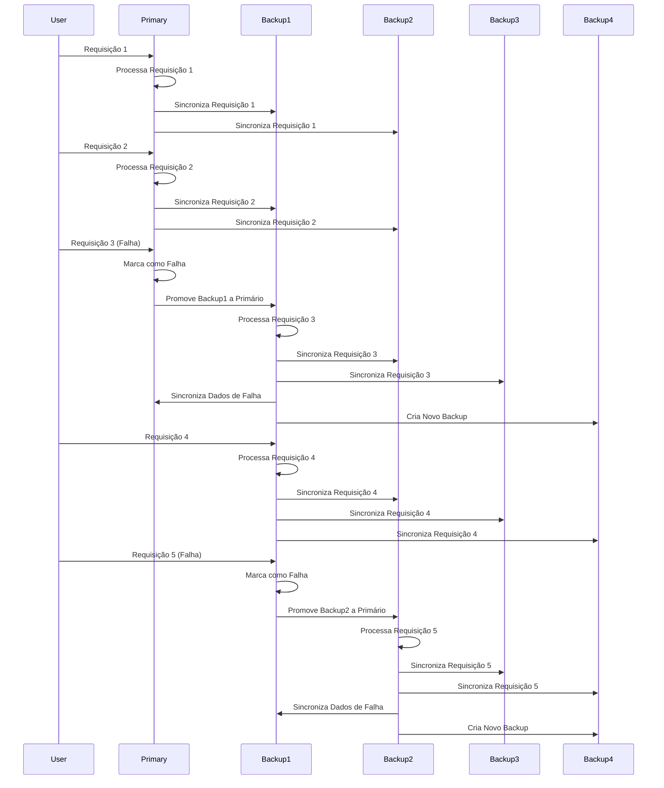

## Visão Geral
Este projeto demonstra um sistema distribuído onde um servidor primário lida com requisições e backups estão prontos para assumir caso o primário falhe. Ele apresenta um backend implementado com Flask e SocketIO e um frontend para visualização usando D3.js.

# Instalação
Para executar esta aplicação, são necessárias as seguintes instalações:
- [Docker & Docker Compose](https://docs.docker.com/manuals/)

## Estrutura de Diretórios
```bash
/replicacao
├── backend/
│   ├── app.py                   # Aplicação principal Flask
│   ├── Dockerfile               # Dockerfile para o serviço backend
│   ├── requirements.txt         # Dependências Python para o backend
├── frontend/
│   ├── static/
│   │   ├── css/
│   │   │   └── styles.css       # Estilos CSS para o frontend
│   │   ├── js/
│   │   │   ├── script.js        # Script D3.js para visualização
│   │   │   └── serverDetails.js # Script para manipulação de detalhes do servidor
│   │   ├── templates/
│   │   │   └── index.html       # Template HTML para o frontend
│   ├── app.py                   # Aplicação Flask para servir o frontend
│   ├── Dockerfile               # Dockerfile para o serviço frontend
│   ├── requirements.txt         # Dependências Python para o frontend
├── docker-compose.yml           # Arquivo Docker Compose para configurar o ambiente
```

## Clonando o Repositório
Para começar, clone o repositório para sua máquina local:
```bash
git clone https://github.com/TarefasUFSC/Sistemas_Distribuidos-Trab_Pratico.git
```

Navegue até o diretório do projeto:

```bash
cd replicacao
```

## Configurando o Ambiente
Navegue até o diretório raiz contendo o arquivo `docker-compose.yml`. Execute os seguintes comandos para construir e iniciar os containers:

### Construindo os Containers:
Para construir os containers do backend e frontend, execute:
```bash
docker compose build
```

### Executando os Containers
Para iniciar os containers, execute:
```bash
docker compose up
```

Se preferir executar os containers no modo desanexado, use o argumento -d:

```bash
docker compose up -d
```

### Parando/Removendo Containers Docker
Para parar os containers, execute:
```bash
docker compose stop
```

Para parar e remover os containers, execute:

```bash
docker compose down
```

### Verificando Logs
Se estiver executando no modo desanexado e quiser visualizar os logs do Docker, execute:
```bash
docker compose logs -f
```

# Serviço Backend
O serviço backend é uma aplicação Flask que lida com o processamento de requisições e sincronização de servidores. Ele usa Flask-SocketIO para comunicação em tempo real com o frontend.

## Principais Componentes
- `app.py`: Contém a aplicação Flask principal com lógica de servidor e sincronização.
- `Dockerfile`: Especifica a configuração da imagem Docker para o serviço backend.
- `requirements.txt`: Lista as dependências necessárias para o backend.

# Serviço Frontend
O serviço frontend fornece uma visualização do status do servidor e lida com interações do usuário. Ele usa D3.js para visualização de dados dinâmica e Flask para servir os arquivos estáticos.

## Principais Componentes
- `static/css/styles.css`: Contém os estilos para o frontend.
- `static/js/script.js`: Contém o script D3.js para visualizar os status dos servidores.
- `static/js/serverDetails.js`: Lida com a exibição de detalhes do servidor.
- `static/templates/index.html`: Template HTML para o frontend.
- `app.py`: Aplicação Flask para servir o frontend.
- `Dockerfile`: Especifica a configuração da imagem Docker para o serviço frontend.
- `requirements.txt`: Lista as dependências necessárias para o frontend.

# Executando a Aplicação
Uma vez que os containers Docker estiverem em execução, você pode acessar a aplicação:

## Acessando o Backend
O serviço backend é executado na porta 5000. Você pode acessá-lo em [http://localhost:5000](http://localhost:5000).

## Acessando o FrontEnd
O serviço frontend é executado na porta 8080. Você pode acessá-lo em [http://localhost:8080](http://localhost:5000).

# Interagindo com a Aplicação
## Enviando Requisições
Você pode enviar requisições para o servidor primário usando os botões na interface do frontend. O backend processará a requisição e atualizará o status do servidor.

## Simulando Falha do Servidor
Você pode simular uma falha do servidor usando o botão de requisição de falha. Isso promoverá um servidor de backup para primário e garantirá a sincronização dos dados.

## Visualizando Detalhes do Servidor
Clique em um círculo do servidor na visualização do frontend para ver seus detalhes, incluindo seus dados processados e sincronizados.

# Conclusão
Seguindo estas instruções, você pode configurar e executar o sistema de servidor distribuído para manipulação de requisições e visualização de status dos servidores.

# Exemplo
